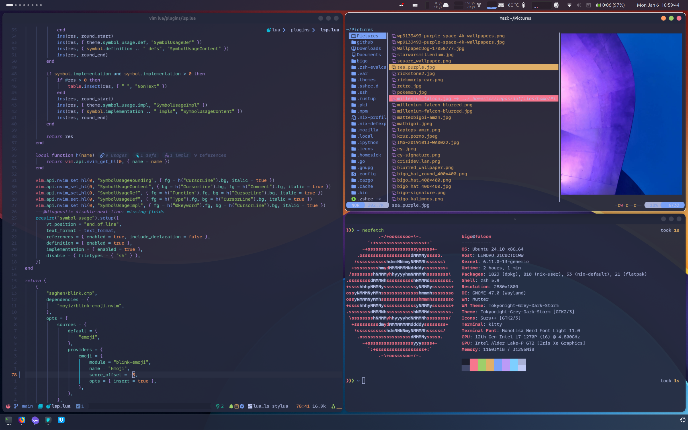

# 🤟 Crisidev Dotfiles 🤟

Take what you need, it also comes warrant free 😊

* [Look and feel](#look-and-feel)
* [Configurations](#configurations)
    * [Terminal](#terminal)
    * [Editor](#editor)
    * [Wayland](#wayland)
    * [X11](#x11)
    * [System](#system)
* [Installation](#installation)

## Look and feel



## Configurations

My personal dotfiles are compatible with
[homesick](https://github.com/technicalpickles/homesick) /
[homeshick](https://github.com/andsens/homeshick)

### Terminal

- [Zsh rc](/home/.zshrc) file
- [Zsh aliases](/home/.zsh_aliases) file
- [Zsh functions](/home/.zsh_functions) file
- [Starship](https://starship.rs) [config](/home/.config/starship.toml) file
- [Kitty](https://sw.kovidgoyal.net/kitty/) [config](/home/.config/kitty) file
- [Tmux](https://github.com/tmux/tmux/wiki) [config](/home/.tmux.conf) file
- [Direnv](https://direnv.net/) [config](/home/.config/direnv) directory

### Editor

See my [lvim](https://github.com/crisidev/lvim) configuration.

### Wayland

- [Hyprland](https://wiki.hyprland.org/) [config](/home/.config/hypr/)
- [Waybar](https://github.com/Alexays/Waybar) [top](/home/.config/waybar/top) and [bottom](/home/.config/waybar/bottom)
* [SwayNC](https://github.com/ErikReider/SwayNotificationCenter) [config](/home/.config/swaync/)

### X11

My old X11, i3 and Gnome based configuration can be found [here](https://github.com/crisidev/dotfiles/tree/x11).

### System

- [Keyd](https://github.com/rvaiya/keyd) [config](/system/etc/keyd/keyd.cfg) file
- [Topgrade](https://github.com/r-darwish/topgrade)
  [config](/home/.config/topgrade.toml) file

There are also plenty of useless and useful scripts inside the [bin/folder](/home/.bin)

## Installation

```sh
❯❯❯ git clone https://github.com/andsens/homeshick.git $HOME/.homesick/repos/homeshick
❯❯❯ git clone https://github.com/crisidev/dotfiles.git $HOME/.homesick/dotfiles
❯❯❯ source "$HOME/.homesick/repos/homeshick/homeshick.sh"
❯❯❯ homeshick link dotfiles
```
