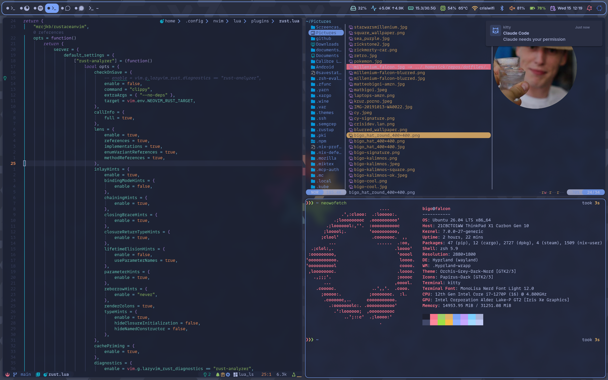

# 🤟 Crisidev Dotfiles 🤟

Take what you need, it also comes warrant free 😊

* [Look and feel](#look-and-feel)
* [Installation](#installation)
* [Hyprland](#hyprland)

## Look and feel



## Installation

```sh
❯❯❯ git clone https://github.com/andsens/homeshick.git $HOME/.homesick/repos/homeshick
❯❯❯ git clone https://github.com/crisidev/dotfiles.git $HOME/.homesick/repos/dotfiles
❯❯❯ source "$HOME/.homesick/repos/homeshick/homeshick.sh"
❯❯❯ homeshick link dotfiles
```

## Hyprland

Hyprland is configured as an optional Wayland session alongside GNOME. It uses the
[Hyprland flake](https://github.com/hyprwm/Hyprland) wrapped with nixGL for non-NixOS systems,
and is themed with [TokyoNight Night](https://github.com/folke/tokyonight.nvim).

**Stack:** Hyprland · Waybar · Wofi · Mako · Hyprlock · Hypridle · swww · wlsunset

### 1. Apply home-manager

```sh
cd ~/.homesick/repos/dotfiles
home-manager switch --flake .#falcon
```

### 2. Register the GDM session (once, requires sudo)

GDM needs a session file to show Hyprland as a login option:

```sh
sudo tee /usr/share/wayland-sessions/hyprland-nix.desktop << 'EOF'
[Desktop Entry]
Name=Hyprland (Nix)
Comment=Dynamic tiling Wayland compositor — TokyoNight
Exec=/home/bigo/.nix-profile/bin/Hyprland
Type=Application
DesktopNames=Hyprland
EOF
```

Log out, select **Hyprland (Nix)** from the GDM session menu, and log in.

### Keybindings

Keybindings mirror the existing GNOME/pop-shell layout from `home/.bin/gsettings-update`.

| Key | Action |
|-----|--------|
| `Super+Return` | Terminal (kitty) |
| `Super+Space` | App launcher (wofi) |
| `Super+W` | Close window |
| `Super+F` | Toggle maximized |
| `Super+Tab` / `Alt+Tab` | Window switcher |
| `Super+Escape` | Workspace 1 |
| `Super+F1/F2/F3` | Workspaces 2–4 |
| `Super+1..4` | Workspaces 5–8 |
| `Super+Shift+...` | Move window to workspace |
| `Super+Alt+arrows` | Move window to adjacent tile |
| `Super+arrows` | Move focus |
| `Super+Alt+Backspace` | Enter resize mode (arrows resize, Esc exits) |
| `Super+Alt+L` | Lock screen |
| `Super+Alt+K` | Suspend |
| `Super+Alt+E` | Exit Hyprland |
| `Super+Alt+P` | 1Password quick access |
| `Super+Alt+D` | Switch monitor layout |
| `Shift+Print` | Screenshot region |
| `Alt+Print` | Screenshot active window |
| `Ctrl+Space` | Nautilus |
| `Super+Z` | IDE |

### System controls

Everything accessible from the Waybar at the top:

| Control | How |
|---------|-----|
| Network | Click wifi icon → nm-connection-editor |
| Bluetooth | Click BT icon → blueman |
| Audio | Click volume icon → pavucontrol |
| Brightness | Scroll on backlight icon |
| Color temperature | Click moon icon → toggle wlsunset |
| USB / removable | udiskie system tray icon |
| Monitor layout | `Super+Alt+D` or run `nwg-displays` |
