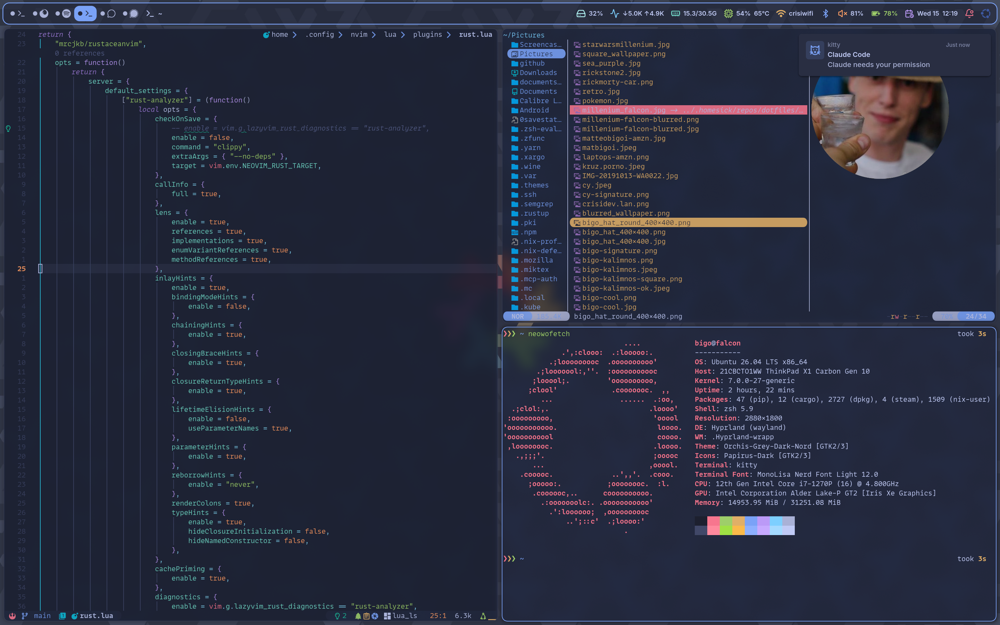

# 🤟 Crisidev Dotfiles 🤟

Take what you need, it also comes warrant free 😊

* [Look and feel](#look-and-feel)
* [Installation](#installation)
* [GNOME](#gnome)

## Look and feel



## Installation

```sh
❯❯❯ git clone https://github.com/crisidev/dotfiles.git $HOME/.config/home-manager
❯❯❯ cd $HOME/.config/home-manager
❯❯❯ ./home-manager switch
```

## GNOME

The desktop is the host (Ubuntu) GNOME Shell with [pop-shell](https://github.com/pop-os/shell)
tiling, configured declaratively in [`home/programs/gnome.nix`](home/programs/gnome.nix):
GTK/cursor/font theming (Orchis-Grey-Dark-Nord · Papirus-Dark · Bibata · Inter) and
every setting as `dconf.settings` — keybindings, pop-shell, workspaces and extension
configuration. `home-manager switch` applies it; there is no imperative
`gsettings` script any more.

Extensions are installed **by hand** (extensions.gnome.org / Extension Manager, into
`~/.local/share/gnome-shell/extensions`). Nix only declares which ones are enabled
and how they are configured, so add a new extension's UUID to `enabled-extensions`
in `gnome.nix` after installing it, or the next switch will disable it.

Helper scripts in `~/.bin` (sources in `home/files/bin`):

* `focus-switch` — workspace focus with back-and-forth, plus `rebalance` to move
  apps back to their workspaces. Talks to
  [mouse-follows-focus](https://github.com/crisidev/mouse-follows-focus) over D-Bus.
* `monitor-switch` — autostarted watcher that sets the text scaling and the kitty font
  size (`~/.config/kitty/font_size.conf`, deliberately not nix-managed) per monitor.
* `clean-notifications` — dismiss all notifications.

### Keybindings

| Key | Action |
|-----|--------|
| `Super+Return` | Terminal (kitty) |
| `Super+Space` | Overview |
| `Super+W` | Close window |
| `Super+Alt+F` | Toggle maximized |
| `Super+Alt+,` | Minimize |
| `Super+Tab` / `Alt+Tab` | App / window switcher |
| `Super+Escape` | Workspace 1 |
| `Super+F2/F1/F3` | Workspaces 2–4 |
| `Super+1..4` | Workspaces 5–8 |
| `Super+Shift+...` | Move window to workspace |
| `Super+Alt+arrows` | Move tile (pop-shell) |
| `Super+Alt+Backspace` | Pop-shell tile mode (arrows resize, Enter/Esc) |
| `Super+Alt+O` / `Y` / `S` / `\` | Orientation / toggle tiling / stacking / floating |
| `Super+Alt+R` | Rebalance windows onto their workspaces |
| `Super+Alt+L` | Lock screen |
| `Super+Alt+K` | Suspend |
| `Super+Alt+E` | Log out |
| `Super+Alt+M` | Clear notifications |
| `Super+Alt+N` | Notification tray |
| `Super+Alt+P` | 1Password quick access |
| `Super+Alt+D` | Switch monitor layout |
| `Shift+Print` / `Alt+Print` | Screenshot region / window |
| `Ctrl+Space` | Nautilus |
| `Super+Z` | IDE |
